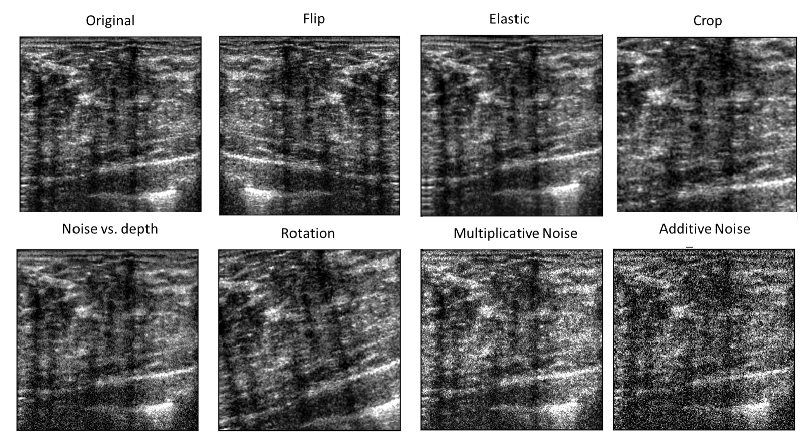

# Augmentations
This folder contains code for data augmentations. Augmentations can be written in different forms, the general form being:

```Python
class Augmentation
    def __init__(self, *args, **kwargs)
        self.args = args
        self.kwargs = kwargs
    
    def __call__(self, input)
        output = some_algorithm(input, *self.args, **self.kwargs)
        return output
```

## Example
Below is an example for augmentations as appear for an ultrasound image:

