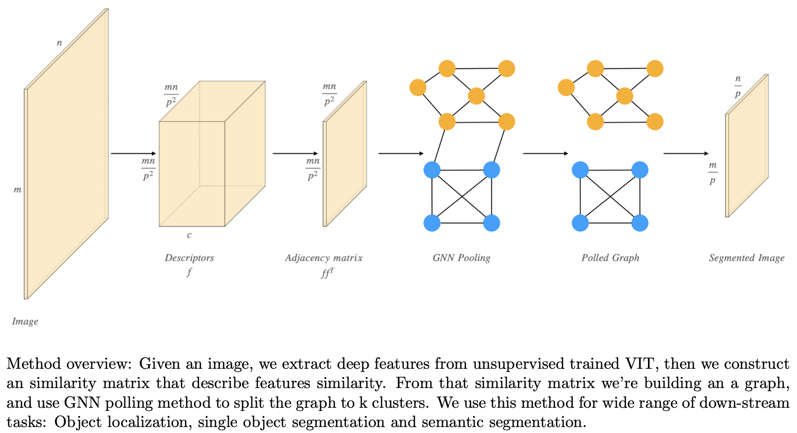
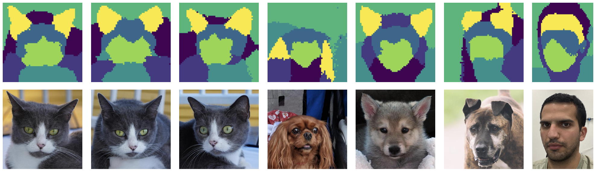
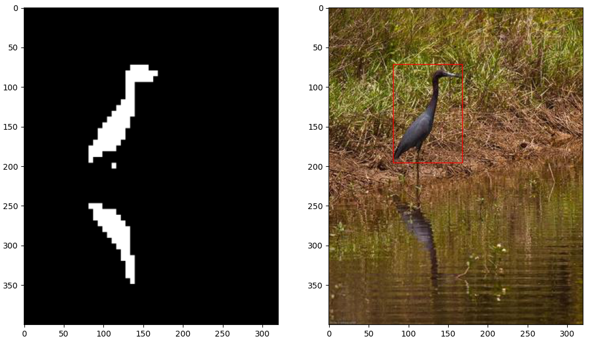
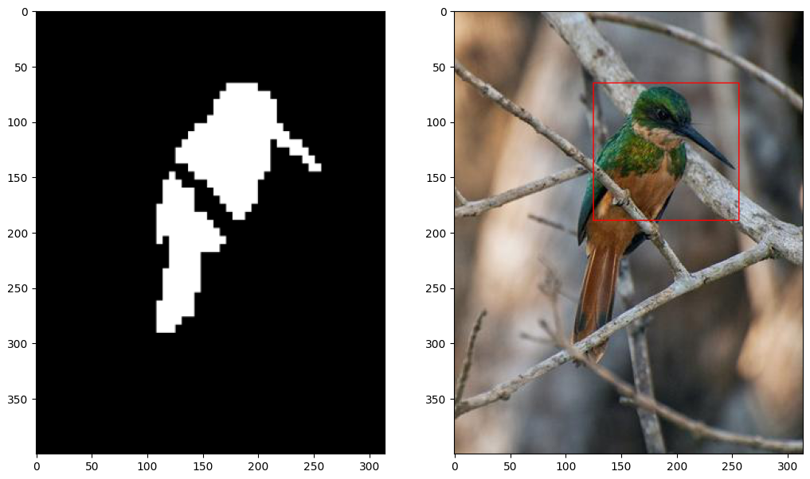

# GNN segmentation

## How to use?

### segment.py
Will divide an input image to K clusters and will show results on the screen.

### co_segment.py
Will apply co segmentation to a set of images (Works only for k==2)

### segment_dataset.py
Non-interactive segment.py, will go thorough an entire dataset and save a segmentation map
or a bounding box of the main object 

## Examples:
