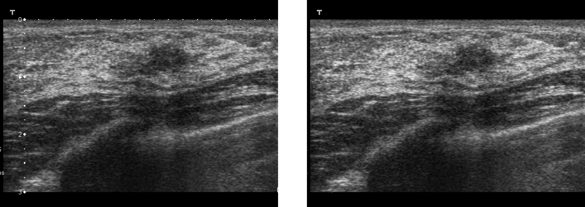

# Preprocessing Utilities
This folder contains code for processing data bfore performing analysis that is sensitive to artifacts that can be removed with simple tools.
Example: Removing text from an ultrasound image. This could be useful if the image is to be used as input to a convolutional neural network.

